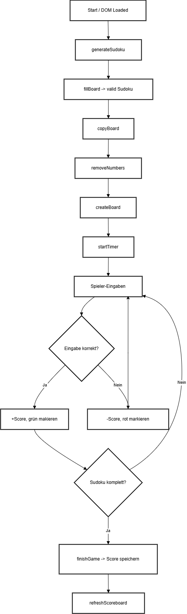

# ITFO2 – Schuljahr 2024/2025  
## Teamorientierte offene Projektarbeit  
### Projektdokumentation – Sudoku 2D

---

## 📌 Projekttitel  
**Sudoku 2D**

## 👥 Teammitglieder  
- Johannes Winkler  
- Tom Van Wüllen  
- Tizian Breuch  
- Walter Wakentin 
- Justin Gasch

---

## 📚 Inhalt  
- [Einleitung](#einleitung)   
- [Vorgehensweise](#vorgehensweise)  
- [Eigene Mitarbeit im Projekt](#eigene-mitarbeit-im-projekt)  
- [Entwicklungsschritte im Detail](#entwicklungsschritte-im-detail)  
- [Gesamtergebnis und Fazit](#gesamtergebnis-und-fazit)  

---

## 🧩 Einleitung  
Dieses Projekt ist ein Sudoku-Spiel, das direkt im Browser gespielt werden kann(sudoku.webtreedesign.de) oder lokal über den Dateiexplorer (`index.html`) aufgerufen werden kann. Es bietet eine dynamische Sudoku-Generierung und ein Scoreboard (das Scoreboard ist nur in Verbindung mit dem Backend verfügbar).  

Ursprünglich war ein 3D-Sudoku geplant, jedoch wurde diese Idee aufgrund der Komplexität verworfen. Stattdessen wurde ein 2D-Sudoku entwickelt, das später um zusätzliche Features erweitert werden kann.

---

### 🎯 Ziel  
#### Muss-Features  
- 🎲 **Dynamische Sudoku-Generierung**: Jedes Spiel ist einzigartig.  
- 🎚️ **Schwierigkeitsgrad**: Drei Schwierigkeitsstufen.  
- 📱 **Responsive Design**: Optimiert für mobile Geräte.  
- 🔄 **Spiel Neustarten**: Beendet die aktuelle Runde und startet ein neues Spiel.  

#### Kann-Features  
- 🏆 **Scoreboard**: Sortiert nach Punkten und Zeit.  
- 🕒 **Timer mit Millisekunden-Präzision**: Verfolge deine Zeit genau.


### 🛠️ Vorgehensweise 
Wir erstellen das Spiel Schritt für Schritt, indem wir jede Funktionalität einzeln umsetzen und testen.
Dabei haben wir uns am **erweiterten Wasserfallmodell** orientiert, bei dem wir einzelne Phasen nacheinander durchlaufen, jedoch auch Rücksprünge bei Bedarf möglich sind.

#### Durchlaufende Phasen:
1. **HTML/CSS-Struktur** für das Spielfeld erstellen  
2. **Sudoku-Raster generieren** mit gültiger Lösung  
3. **Lösbarkeit gewährleisten**, indem Zahlen entfernt werden  
4. **Interaktive Spielfelder** mit Benutzereingabe  d
5. **Modulare Funktionen** entwickeln und testen

Nach einer **Abstimmung im Team** haben wir uns auf einen gemeinsamen Grundbaustein geeinigt bevor wir die Phasen wieder durchlaufen.
Jeder hat zunächst ein eigenes Konzept eingebracht – das beste Konzept wurde per Abstimmung ausgewählt, anschließend haben wir dieses gemeinsam weiterentwickelt und durch individuelle Verbesserungen ergänzt.
Nachdem wir ein Soliden aufbau hatten, haben wir die nächsten Schritte im Entwicklungsprozess umgesetzt und ausgebessert.

---

## 👨‍💻 Eigene Mitarbeit im Projekt – Vorgehensweise und Arbeitsergebnisse 

### 🔄 Projektplanung  
In regelmäßigen abstimmungen haben wir den aktuellen Stand abgeglichen und neue To-dos verteilt. Bei Verzögerungen wurden Aufgaben flexibel umverteilt.

### 📐 Modellierung  
## 🧠 Technischer Überblick & Aufbau

Wir haben unsere ersten Entwürfe als **Mockups** erstellt, um eine klare Vorstellung vom finalen Layout und Spielfluss zu bekommen. Anschließend wurden die zentralen Funktionalitäten in der Datei `sudoku.js` definiert.

Dabei haben wir uns auf die **Herzstücke** des Projekts konzentriert, insbesondere auf folgende zentrale Funktionen:

- `generateSudoku()`  
- `fillBoard()`  
- `copyBoard()`  
- `removeNumbers()`  
- `createBoard()`

Ein zentrales Element ist die Funktion **`solveSudoku()`**, die aus `removeNumbers()` aufgerufen wird, um sicherzustellen, dass das generierte Sudoku immer nur **eine eindeutige Lösung** hat.  
Sie ist essenziell, um ein gültiges Spielfeld zu gewährleisten.

---

## 🔄 Ablauf des Programms

Im Folgenden ist der **grobe Ablauf des Programms** grafisch dargestellt:



Das Aktivitätsdiagramm zeigt die Hauptphasen des Spiels – vom Laden des DOMs bis hin zur Benutzerinteraktion, Validierung der Eingaben und dem Abspeichern des Highscores.


Die funktionen haben wir 
### 💻 Implementierung  
- **Programmiersprache:** JavaScript  
- **Implementieungsschritte:** Visual Studio Code  
- **Codebespiele:** Git

### 📁 Qualitätssicherung  

### Codebeispiele Beispiel: `createBoard()`
```js
function createBoard() {
  const board = document.getElementById('sudoku-board');
  for (let row = 0; row < 9; row++) {
    for (let col = 0; col < 9; col++) {
      const cell = document.createElement('input');
      cell.type = 'text';
      cell.maxLength = 1;
      board.appendChild(cell);
    }
  }
}
