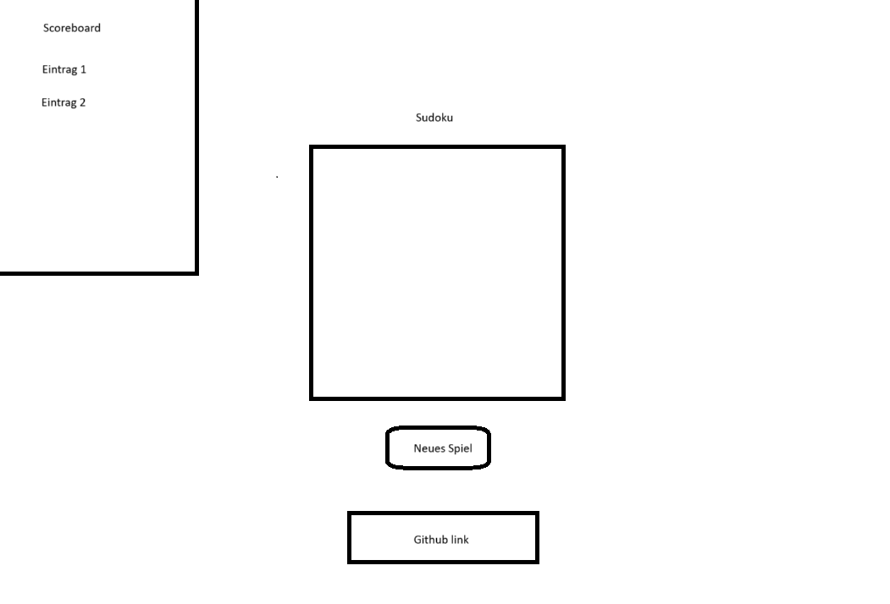
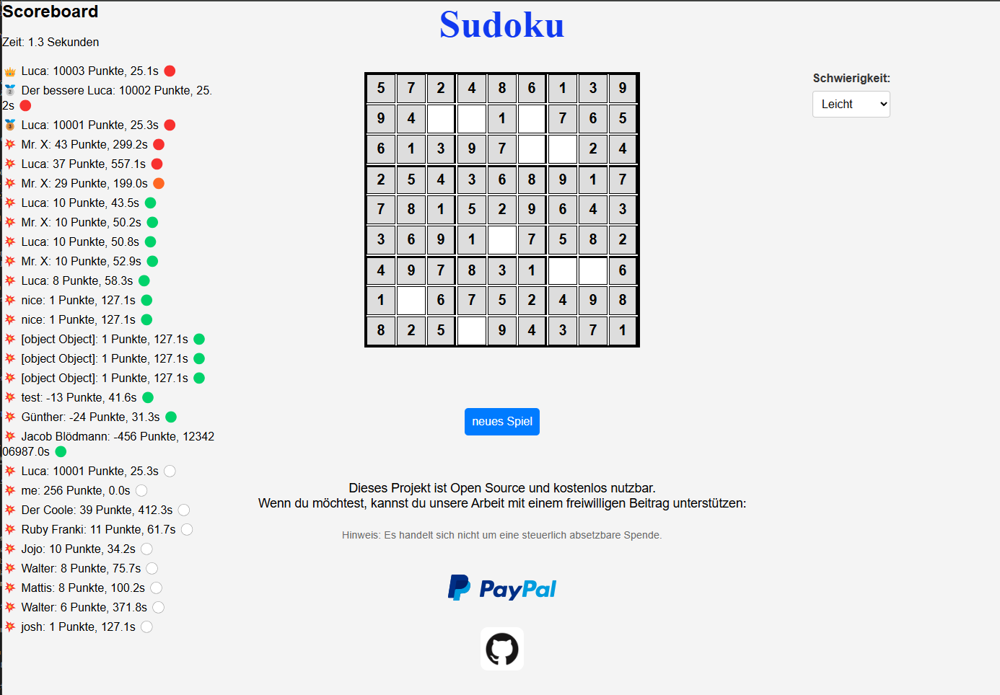

# ITFO2 – Schuljahr 2024/2025

## Teamorientierte offene Projektarbeit

### Projektdokumentation – Sudoku 2D

---

## 📌 Projekttitel

**Sudoku 2D**

## 👥 Teammitglieder

- Johannes Winkler
- Tom Van Wüllen
- Tizian Breuch
- Walter Wakentin
- Justin Gasch

## 📚 Inhalt

- [Einleitung](#einleitung)
- [Vorgehensweise](#vorgehensweise)
- [Eigene Mitarbeit im Projekt](#eigene-mitarbeit-im-projekt)
- [Entwicklungsschritte im Detail](#entwicklungsschritte-im-detail)
- [Gesamtergebnis und Fazit](#gesamtergebnis-und-fazit)

## 🧩 Einleitung

### Projektbeschreibung

Dieses Projekt ist ein Sudoku-Spiel, das direkt im Browser gespielt werden kann(sudoku.webtreedesign.de) oder lokal über den Dateiexplorer (`index.html`) aufgerufen werden kann. Es bietet eine dynamische Sudoku-Generierung und ein Scoreboard (das Scoreboard ist nur in Verbindung mit dem Backend verfügbar).

Ursprünglich war ein 3D-Sudoku geplant, jedoch wurde diese Idee aufgrund der Komplexität verworfen. Stattdessen wurde ein 2D-Sudoku entwickelt, das später um zusätzliche Features erweitert werden kann.

### Zielsetzung

#### Muss-Features

- 🎲 **Dynamische Sudoku-Generierung**: Jedes Spiel ist einzigartig.

- 📱 **Responsive Design**: Optimiert für mobile Geräte.
- 🔄 **Spiel Neustarten**: Beendet die aktuelle Runde und startet ein neues Spiel.

#### Kann-Features

- 🎚️ **Schwierigkeitsgrad**: Drei Schwierigkeitsstufen.
- 🏆 **Scoreboard**: Sortiert nach Punkten und Zeit.
- 🕒 **Timer mit Millisekunden-Präzision**: Verfolge deine Zeit genau.
- **bakend und Datenbank** : backend als api mit datenbank andbindunng

---

## Eigene Mitarbeit im Projekt – Vorgehensweise

Wir erstellen das Spiel Schritt für Schritt, indem wir jede Funktionalität einzeln umsetzen und testen.
Dabei haben wir uns am **erweiterten Wasserfallmodell** orientiert, bei dem wir einzelne Phasen nacheinander durchlaufen, jedoch auch Rücksprünge bei Bedarf möglich sind.

#### Durchlaufende Phasen:

1. **HTML/CSS-Struktur** für das Spielfeld erstellen
2. **Sudoku-Raster generieren** mit gültiger Lösung
3. **Lösbarkeit gewährleisten**, indem Zahlen entfernt werden
4. **Interaktive Spielfelder** mit Benutzereingabe
5. **Modulare Funktionen** entwickeln und testen

Nach einer **Abstimmung im Team** haben wir uns auf einen gemeinsamen Grundbaustein geeinigt bevor wir die Phasen wieder durchlaufen.
Jeder hat zunächst ein eigenes Konzept eingebracht – das beste Konzept wurde per Abstimmung ausgewählt, anschließend haben wir dieses gemeinsam weiterentwickelt und durch individuelle Verbesserungen ergänzt.
Nachdem wir ein Soliden aufbau hatten, haben wir die nächsten Schritte im Entwicklungsprozess umgesetzt und ausgebessert.

### Zeitplanung

Phase 1 – Projektstart und Planung (Woche 1-2)
Teilnahme an der Konzeptionsphase und ersten Teambesprechungen
Mitwirken bei der Auswahl des Spieltyps (von 3D zu 2D-Sudoku)
Ideensammlung und Diskussion möglicher technischer Ansätze
Grobe erstellungen der ersten funktionen

Phase 2 – Umsetzung und Übergabe (Woche 3-4)
Aufgrund einer Krankheitsphase konnte ich in dieser Zeit nicht aktiv mitarbeiten
Meine bisherigen Entwürfe zur Spiellogik wurden an das Team (Johannes, Tom, Walter und Justin) übergeben
Das Team führte die Umsetzung der Grundlogik eigenständig weiter

Phase 3 – Wiedereinstieg und aktive Umsetzung (Woche 5)
Nach meiner Rückkehr stieg ich wieder voll in die Projektarbeit ein
Fokus lag auf der Backend-Entwicklung:
Entwicklung eines Node.js-Servers mit REST-API
Anbindung an MongoDB zur Speicherung von Highscores
Deployment des Servers
Zusammenarbeit mit dem Team zur Integration der Schnittstellen ins Frontend
Fehleranalyse und Optimierung der Scoreboard-Logik

Phase 4 – Abschluss und Qualitätssicherung (Woche 6)
Durchführung finaler Tests zur Datenübertragung und Sortierlogik
Manuelle Tests mit Testdaten
Unterstützung bei der Finalisierung der Projektdokumentation

Phase 5 - Dokumentation (Woche 7-8)
In den letzten Projektwochen habe ich parallel zur Entwicklungsarbeit mit der Erstellung der Projektdokumentation begonnen. Dabei habe ich besonders meine eigenen Beiträge – etwa die Backend-Entwicklung, den Umgang mit der Krankheitsphase und die technische Umsetzung – detailliert beschrieben. Zusätzlich habe ich Codebeispiele kommentiert, technische Abläufe erklärt und die Architektur des Systems verständlich dargestellt. Ziel war es, die Inhalte klar, nachvollziehbar und praxisnah aufzubereiten.

### Aufgabenverteilung im Team

Die Aufgaben im Team wurden entsprechend der individuellen Stärken und Interessen verteilt. Trotz klarer Schwerpunkte gab es regelmäßige Zusammenarbeit, insbesondere beim Testen und Optimieren des Spiels.

Tizian Breuch
Frontend-Design: Gestaltung der Benutzeroberfläche und Responsiveness
Backend-Entwicklung: Umsetzung eines Node.js-Servers mit REST-API
Datenbank-Anbindung: Speicherung der Spielerdaten via MongoDB
Deployment: Veröffentlichung des Backends auf einem Webserver
Sekundär: Mitarbeit an der Boardlogik und Spielfeldern

Tom Van Wüllen
Frontend: Umsetzung der Spielansicht, Eingabefelder und Interaktionen
Sekundär: Unterstützung bei der Boardlogik

Walter Wakentin, Johannes Winkler, Justin Gasch
Primär: Entwicklung der Boardlogik, insbesondere:
Sudoku-Generator
Validierung von Eingaben
Spielfluss-Logik

Alle Teammitglieder
Testen und Optimieren des gesamten Spiels
Gemeinsames Debugging und Verbesserung der Nutzererfahrung

## Eigene Mitarbeit im Projekt – Arbeitsergebnisse

### Modellierung

Die Architektur des Systems wurde so gestaltet, dass das Frontend über eine REST-API mit dem Backend kommuniziert. Die Daten werden persistent in einer MongoDB-Datenbank gespeichert. Die grobe Struktur lässt sich wie folgt darstellen:

- **Frontend** (HTML, CSS, JavaScript)
- **Backend** (Node.js, Express)
- **Datenbank** (MongoDB)
- **Kommunikation**: HTTP (REST), JSON

nach ersten absprachen und ersteluung der ersten arbeitsprozesse habe ich ein Aktivitätsdiagramm zum ablauf usnerer funktionen erstellt. Dieser ablauf wurde im laufe des projekt variert und angpasst.

Da das forntend sehr simpel aufgestellt ist habe ich daz ein wireframe erstellt aber auch einen screenshot der produktiv setzung angegeben

#### Verwendete Programmiersprache

- **Frontend**: JavaScript (Vanilla), HTML, CSS
- **Backend**: JavaScript mit Node.js und Express
- **Datenbank**: MongoDB
- **Entwicklungsumgebung**: Visual Studio Code

### Implementierung

Während der Planungsphase habe ich gemeinsam mit dem Team die grundlegenden Anforderungen für das Sudoku-Spiel definiert. Die Aufgaben wurden nach Interessen und Stärken verteilt. Ich übernahm zunächst die Erstellung der Board-Logik.

Mein Einstieg begann mit der createElement-Funktionalität, um das Sudoku-Board dynamisch in HTML zu generieren. Dieser Schritt diente als grundlegende Voraussetzung für alle weiteren Funktionen. Im Anschluss folgte die Implementierung der Eingabemöglichkeiten, um den Nutzer:innen eine Interaktion mit dem Spielfeld zu ermöglichen.

Zusammen mit dem Team entwickelte ich die ersten Bausteine der Funktionen fillBoard und solveBoard, die für die Spiellogik essenziell sind.

Nach einer längeren Krankheitsphase hatte das Projekt bereits eine gute Form angenommen. Das Team baute auf meinen Grundlagen auf und konnte die Logik während meiner Abwesenheit erfolgreich fertigstellen. Nach meiner Rückkehr trafen wir weitere Absprachen, beseitigten verschiedene Fehler (u. a. fehlerhafte Eingabevalidierung bei einstelligen Zahlen), bereinigten und strukturierten den Code neu, um die Lesbarkeit zu verbessern. Anschließend testeten wir die lokale Ausführung intensiv, um Fehler zu identifizieren und sicherzustellen, dass es nach dem finalen Zusammenführen aller Änderungen zu keinen Merge-Konflikten kam.

Nach Abschluss dieser Arbeiten war die Kernimplementierung fertiggestellt. Im Anschluss besprachen wir mögliche Zusatzfunktionen und Erweiterungen.

Aus diesen Gesprächen heraus entstand die Idee eines Scoreboard-Systems mit Online-Funktionalität. Dieses Feature war ursprünglich nicht Teil der Projektplanung und wurde daher als optionale Erweiterung ohne Priorisierung behandelt.

Die komplette Scoreboard-Logik, einschließlich der Anbindung an MongoDB und des Deployments auf einem Webserver, wurde von mir umgesetzt. Justin entwickelte das Punktesystem, welches festlegte, wann Spieler:innen Punkte gewinnen oder verlieren. Nach der Fertigstellung des Backends passte ich dieses Punktesystem entsprechend an, da zusätzliche Felder wie der Schwierigkeitsgrad ergänzt wurden.

Das Backend wurde mit Node.js entwickelt, containerisiert und mithilfe von Docker sowie NGINX auf einem Server veröffentlicht und zugänglich gemacht.

Parallel zur Entwicklung des Scoreboards arbeitete Tom an der Integration eines Schwierigkeitsgrad-Features, das ich anschließend in den POST-Requests und der Datenbank ergänzte, sodass die Daten korrekt übermittelt und gespeichert wurden.

#### Implementierungsschritte

1. Entwurf und Implementierung der Funktion `createBoard` im Frontend
2. Entwicklung eines Node.js-Servers mit REST-Endpunkten
3. Anbindung an MongoDB zur Speicherung von Spielergebnissen
4. Deployment des Servers mit Docker und NGINX auf einem Webserver
5. Erweiterung der Scoreboard-Logik zur dynamischen Sortierung nach Schwierigkeit, Score und Zeit (nachträglich ergänzt)
6. Fehlerbehebung und Codeoptimierung im Gesamtprojekt
7. Integration des Schwierigkeitsgrads in Frontend, Backend und Datenbank (gemeinsam mit Tom)

### Qualiatätssicherung

Die Qualitätssicherung erfolgte im Rahmen der Projektumsetzung hauptsächlich durch manuelle Tests. Ziel war es, sowohl die Funktionalität als auch die Stabilität der Anwendung sicherzustellen.

Testmethoden und Maßnahmen
Manuelle Eingabetests
Während der Implementierung wurden regelmäßig gezielte Eingaben durchgeführt, um die Validierung der Spielfelder zu prüfen. Dies betraf insbesondere die Boardlogik sowie die Sicherstellung, dass stets ein gültiges Sudoku erzeugt wurde.

Fehleranalyse und Debugging
Auftretende Fehler, wie etwa fehlerhafte Eingabevalidierungen, wurden mithilfe von Konsolenausgaben und gezieltem Debugging identifiziert und behoben. Das gesamte Team war in die Fehleranalyse eingebunden.

HTTP-Statuskontrolle
Bei der Entwicklung der REST-API wurden verschiedene Szenarien getestet, z. B. fehlerhafte oder unvollständige Anfragen. Ziel war es, die Korrektheit der Serverantworten und die Robustheit der Validierungsmechanismen sicherzustellen.

Testdaten und Sortierlogik
Die Sortierung im Scoreboard wurde mit einer Vielzahl an Testdatensätzen geprüft, um sicherzustellen, dass Schwierigkeit, Punktestand und Zeit korrekt gewichtet und dargestellt werden.

Fehlertests beim Zusammenführen der Teamarbeit
Nach dem finalen Merge aller Teilbereiche wurden gezielt potenzielle Konflikte identifiziert und bereinigt, um eine stabile Endversion zu gewährleisten.

Getestete Komponenten
Sudoku-Generator und Spielfeld-Validierung

Eingabefelder und Punktevergabe im Frontend

API-Endpunkte zur Speicherung und Abfrage von Spielergebnissen

Sortierlogik im Scoreboard

Kommunikation zwischen Frontend und Backend

Die Qualitätssicherung war ein durchgängiger Bestandteil der gesamten Projektarbeit. Alle Teammitglieder beteiligten sich aktiv durch wiederholtes Testen, Fehlermeldungen und gemeinsames Debugging.

## Gesamtergebnis und Fazit

### Arbeitsergebnisse und Evaluation

Das Projektziel, ein vollständig spielbares und dynamisch generiertes Sudoku-Spiel mit optionalem Online-Scoreboard, wurde erfolgreich erreicht. Die Anwendung ist funktional, benutzerfreundlich und responsiv gestaltet. Die dynamische Sudoku-Generierung, die Eingabemöglichkeiten sowie die Punkte- und Zeitmessung funktionieren zuverlässig und nachvollziehbar.

Besonders hervorzuheben ist die reibungslose Integration des Backends mit Datenbankanbindung und REST-API, was eine Speicherung und Auswertung von Spielergebnissen ermöglicht. Auch die nachträglich umgesetzte Sortierlogik im Scoreboard wurde erfolgreich realisiert und trägt zur Spielmotivation bei.

Das Backend wurde mithilfe von Docker containerisiert und über einen Webserver mit NGINX bereitgestellt. Dabei schützt NGINX den Server unter anderem vor gängigen DDOS-Angriffen und sorgt für eine stabile Auslieferung der Dienste. Die REST-API selbst ist jedoch nicht gegen unbefugte Zugriffe abgesichert – sie ist öffentlich zugänglich, sodass beliebige POST-Requests beispielsweise über Postman oder andere Tools an die API gesendet werden können. Dadurch besteht das Risiko, dass unautorisierte Nutzer Daten in der Datenbank speichern oder manipulieren. Für zukünftige Projekte wäre daher eine Authentifizierung und Zugriffskontrolle sinnvoll.

Im Laufe des Projekts wurden verschiedene Herausforderungen gelöst, z. B. bei der Validierung der Spielfelder, dem Zusammenspiel von Frontend und Backend sowie beim Deployment. Insgesamt entspricht das Endergebnis den Anforderungen, übertrifft sie in einigen Bereichen (z. B. durch das Scoreboard-Feature) sogar.

### Reflexion

Rückblickend hat das Projekt nicht nur meine technischen Fähigkeiten im Bereich Webentwicklung, API-Design und Datenbankanbindung gestärkt, sondern mir auch gezeigt, wie wichtig strukturierte Teamarbeit und klare Kommunikation sind. Die krankheitsbedingte Unterbrechung stellte eine Herausforderung dar, konnte aber durch gute Dokumentation und Zusammenarbeit im Team erfolgreich kompensiert werden.

Besonders bewährt hat sich in unserem Projekt das erweiterte Wasserfallmodell. Da wir viele Entwicklungsschritte mehrfach durchlaufen mussten – insbesondere zwischen Design, Implementierung und Test – war diese Vorgehensweise genau richtig für uns. Häufige Rücksprünge und wiederholte Überarbeitungen einzelner Komponenten (z. B. der Spiellogik oder des Scoreboards) waren notwendig, um ein stabiles und funktionierendes Ergebnis zu erzielen. Das Modell gab uns dabei eine klare Struktur, ohne uns in der Flexibilität einzuschränken.

Ein weiterer wichtiger Aspekt war die Versionsverwaltung. Für ein teamorientiertes Projekt dieser Art ist eine strukturierte Git-Branch-Verwaltung essenziell, um paralleles Arbeiten ohne Konflikte zu ermöglichen. Diese Struktur führten wir jedoch erst später im Projektverlauf ein. Zu Beginn wurden Änderungen häufig manuell zusammengeführt, indem einzelne Teammitglieder ihren aktuellen Stand an andere übergaben. Erst durch die Einführung einer sauberen Branch-Struktur konnte effizienter und konfliktfreier gearbeitet werden.

Durch die intensive Arbeit am Backend, insbesondere am Scoreboard-System, habe ich viel über den praktischen Einsatz von Node.js, Express, MongoDB, Docker und Deployment gelernt. Auch die Zusammenarbeit mit dem Frontend-Team hat mir verdeutlicht, wie wichtig Schnittstellen-Definitionen und saubere Datenflüsse sind.

Insgesamt war das Projekt eine wertvolle Erfahrung – sowohl fachlich als auch im Hinblick auf Teamarbeit, Selbstorganisation, Versionskontrolle und Problemlösung. Für zukünftige Projekte nehme ich mit, wie wichtig frühzeitige Planung, kontinuierliches Testen, technische Absicherung und eine klare Aufgabenverteilung sind.
